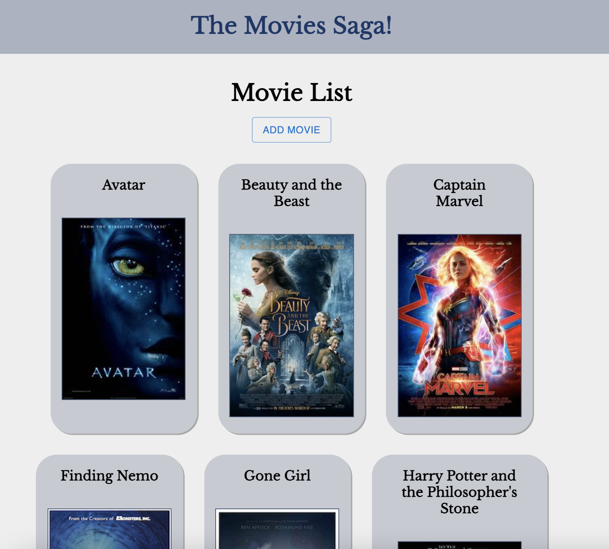

    
    
# Movies 

## Table of Contents

- [Description](#description)
- [Screenshots](#screenshots)
- [Built With](#built-with)
- [Getting Started](#getting-started)
  - [Prerequisites](#prerequisites)
  - [Installation](#installation)
- [Usage](#usage)
- [License](#license)
- [Acknowledgements](#acknowledgements)
- [Contacts](#contacts)

## Description

A React application that allows users to add and manage a movie database. Users can scroll through movie selection and click on a movie to see more details on the "Details" page. Users can add movies to the database on the "Add Movie" page. 

## Screenshots

Home Page

Details Page

Add Movie

## Built With

## Getting Started

1. Create a database named `saga_movies_weekend`
2. Run the queries from `database.sql` on the `saga_movies_weekend` database

## Install Dependencies

1. `npm install`
2. `npm run server`
3. `npm run client`

### Prerequisites

What do I need to install before I can run your project

### Installation

HTML
CSS
JavaScript
React
Redux
redux-sagas
Axios
Node.js
Express
Postgresql

## Usage

How do I use your project

## License

<a href="https://choosealicense.com/licenses/mit/">MIT License</a>

## Acknowledgements

Thank you to Prime Digital Academy and to instructors Dev Jana and Casie Siekman!

## Contacts

  